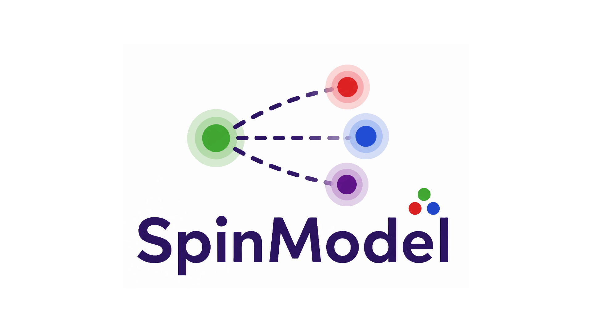

<p align="center">
  
</p>

# SpInModel.jl

[](LICENSE)


A Julia package for large-scale **Spatial Interaction Models (SIMs)** and gravity-based flow estimation.

SpInModel.jl is designed for the calibration, estimation, and analysis of spatial interaction systems inspired by the work of:

- Alan Wilson's entropy-maximizing models
- Fotheringham's competing destinations framework
- classical gravity models
- constrained origin-destination balancing procedures

The package aims to provide a high-performance and scalable Julia implementation for modern spatial interaction analysis on very large O-D matrices.

---

# Features

## Spatial Interaction Models

Implementation of:

- Unconstrained gravity models
- Production-constrained models
- Attraction-constrained models
- Doubly-constrained models

including iterative balancing procedures for origin-destination matrices.

---

## Impedance Calibration

SpInModel.jl focuses on the estimation and calibration of impedance / distance-decay parameters:

\[
T_{ij} = A_i O_i B_j D_j f(c_{ij})
\]

with support for:

- exponential impedance functions
- power-law impedance functions
- automatic parameter calibration
- convergence diagnostics
- balancing factor estimation

---

## Large-scale O-D Matrices

The package is designed with scalability in mind:

- optimized Julia implementations
- sparse and dense matrix support
- blockwise computation strategies
- future support for distributed computation across multiple nodes
- HPC-oriented workflows for very large interaction systems

---

## Future Goals

Planned developments include:

- competing destinations models
- intervening opportunities models
- GPU acceleration
- distributed balancing algorithms
- MPI / multi-node support
- integration with GeoDataFrames.jl ecosystems
- accessibility and transport modeling workflows

---

# Why Julia?

Julia provides an ideal environment for spatial interaction modeling because it combines:

- high-level scientific programming
- native parallelism
- HPC capabilities
- multiple dispatch
- near-C performance

SpInModel.jl aims to leverage these strengths for computational geography and spatial economics.

---

# Installation

```julia
using Pkg
Pkg.add(url="https://github.com/GiacomoGaliazzo/SpInModel.jl")
```

---

# Example

```julia
using SpInModel

# future API example

model = DoublyConstrainedModel(
    origins,
    destinations,
    costs;
    impedance = :exponential
)

fit!(model)

flows = predict(model)
```

---

# Scientific Background

Spatial interaction models are widely used in:

- transportation modeling
- accessibility analysis
- migration studies
- retail geography
- urban systems
- regional economics
- commuting analysis
- land-use interaction modeling

SpInModel.jl is inspired by the theoretical foundations established by:

- Alan Wilson
- A. Stewart Fotheringham
- Waldo Tobler
- quantitative geography and spatial analysis literature

---

# Dataset

The example dataset `flussi_north_lom_minuti_auto.txt` is from:

> *Measuring Space-Time Accessibility: Hansen's Model Vs. Machine Learning*

kindly provided by Dr. Hadjidimitriou under CC BY 4.0 License.

---

# Project Status

SpInModel.jl is currently under active development.

The project roadmap focuses on:

- numerical robustness
- scalable balancing algorithms
- distributed computation
- reproducible spatial modeling workflows

Contributions, discussions, and suggestions are welcome.

---

# License

MIT License.
